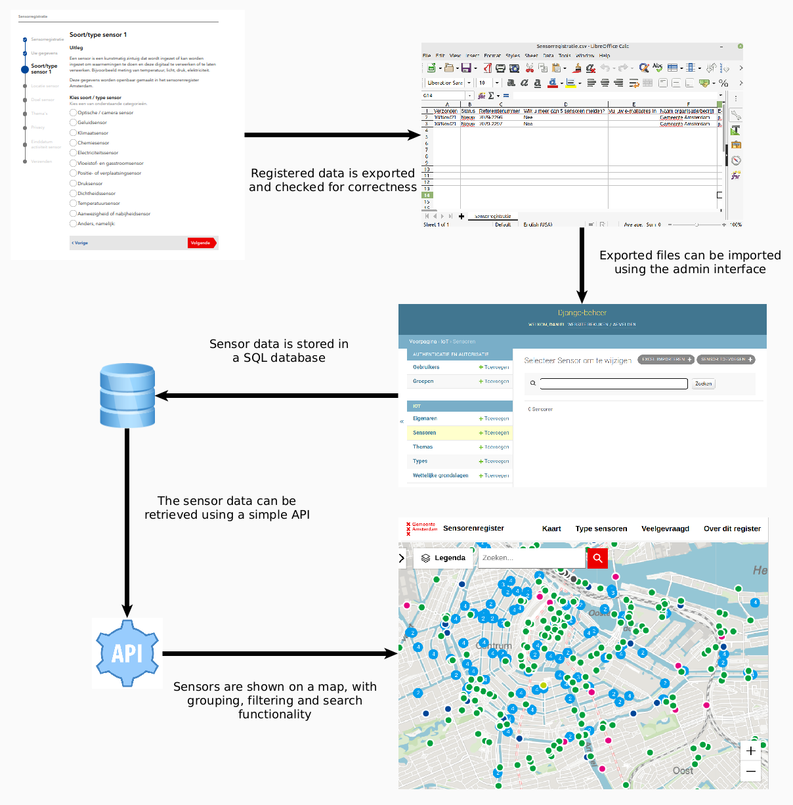
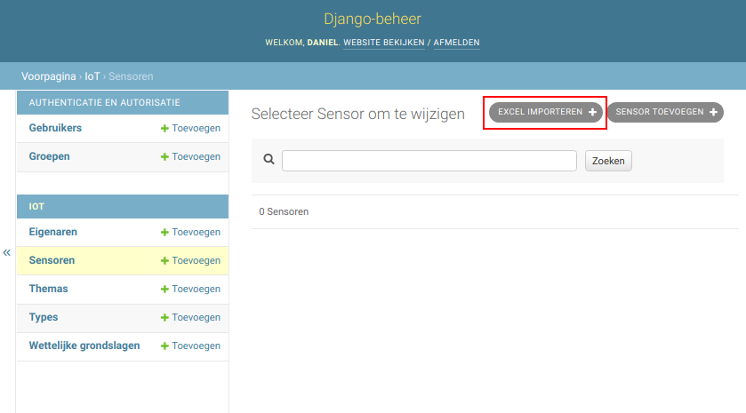

# iot
This project serves the data for the Amsterdam [sensoren register](https://sensorenregister.amsterdam.nl/).
The front end can be found in the Amsterdam [github](https://github.com/Amsterdam/).
There is also a [form](https://formulier.amsterdam.nl/thema/privacy/sensorregistratie/) which is used
by citizens to register sensors (from 1 December 2021 it is compulsary to register sensors in public spaces in Amsterdam)

### Data flow

The registration of sensors via a form is decoupled from this project. This has a number of disadvantages:

* The form itself is built using IPROX, which limits the functionality that can be offered to the user.
* There is no immediate feedback to the person registering the sensor if they enter any incorrect data.
* There is no way for a citizen to edit the sensors for which they are responsible.

Despite this the IPROX form could be set up quickly. In order to support this flow we need to implement an
import command which can import the data from the IPROX export. The following diagram shows how the data flows
from the user registering the sensor data to it being displayed in the front end.



### How to run

```
make app
```

### Running tests

```
make test
```

### How to import data

Data can be imported from the django admin:



There are a number of csvs in the test folders which can be used as a basis for creating test data.

### Developing

This project uses the standard makefile as described in the [dev guide](https://github.com/Amsterdam/opdrachten_team_dev),
The structure however is not currently in line with this standard (see TAO-897)